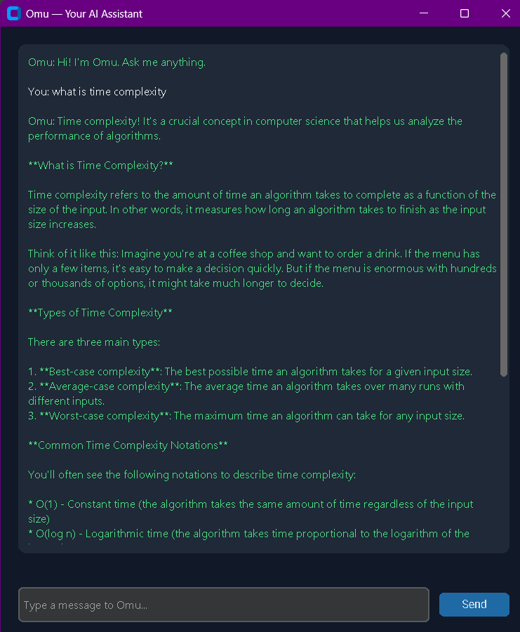

# Omu — Personal AI Assistant with Memory

Everything here is free and runs locally on your machine. No cloud accounts, no API keys.

### Omu in action

*Omu's desktop interface — green replies from Omu, white messages from you, with a live "thinking..." indicator while it generates a response.*

## What you already have
- Ollama installed, with `llama3.1:8b` pulled and stored on your `D:` drive.

## Project files

- `main.py` — terminal version of Omu (type in a console window)
- `gui.py` — desktop window version of Omu, with colored chat and a loading animation
- `memory.py` — long-term memory (ChromaDB + local embeddings)
- `llm.py` — talks to your local Ollama model
- `voice.py` — text-to-speech, so Omu speaks its replies out loud
- `requirements.txt` — all required packages
- `start_omu.bat` — double-click launcher for the GUI version

## Setup (one-time)

1. Put all the files above in a folder, e.g. `D:\Omu\`

2. Open Command Prompt and go to that folder:
   ```
   cd /d D:\Omu
   ```

3. Create a virtual environment (keeps packages tidy, optional but recommended):
   ```
   python -m venv venv
   venv\Scripts\activate
   ```

4. Install the required packages:
   ```
   pip install -r requirements.txt
   ```
   This installs chromadb, sentence-transformers, requests, pyttsx3, and customtkinter — all free, no accounts needed.

## Running Omu

**Important: Ollama's server must be running in its own terminal window first.**

1. Open a Command Prompt and run:
   ```
   ollama serve
   ```
   Leave this window open in the background the whole time you're using Omu.

2. In a **separate** terminal, go to your Omu folder and run either:

   **GUI version (recommended):**
   ```
   cd /d D:\Omu
   python gui.py
   ```
   Or just double-click `start_omu.bat`.

   **Terminal version:**
   ```
   cd /d D:\Omu
   python main.py
   ```
   Type `exit` to quit.

## How the memory works

- Every time you talk to Omu, the conversation is saved into a local database folder called `omu_memory_db` (created automatically next to the scripts).
- Next time you ask something related, Omu searches that database for relevant past exchanges and includes them as context before generating its reply.
- This is what gives the *feeling* of Omu "remembering" you over time — no fine-tuning needed.

## Next steps

- Add "skills" — e.g. functions Omu can call for weather, opening apps, web search, etc.
- Add voice **input** (speech-to-text) using `SpeechRecognition`, so you can talk instead of type
- Package everything into a standalone `.exe` so it doesn't need a Python install to run

## Note on performance

This runs entirely on CPU by default unless you have a compatible GPU set up with Ollama, so replies can take anywhere from several seconds to a couple of minutes depending on your hardware. If responses feel too slow, try a smaller model like `llama3.2:3b` instead of `llama3.1:8b`.
